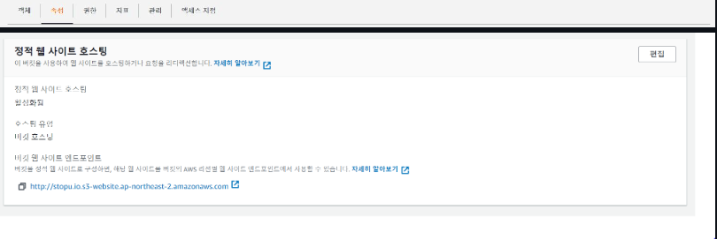

# 가장 먼저 위치설정 확인
 

## AWS S3 과정
```
1. 버킷 만들기
```

 

```
2. 버킷 이름 = 내가 할 도메인 주소 입력
EX = gyusung.com/.io/.pro/.net ...
```

 

```
3. 이름 클릭
```

 


```
4. 속성 > 스크롤 마지막 정적 웹 사이트 호스팅
```
 

```
5. 인덱스 문서 항목에 내가 올릴 html파일의 이름과 동일하게 작성
```
 

```
6. 권한 -> 퍼블릭 엑세스 차단(버킷 설정) 클릭
```
 

```
7. 체크박스 전체 해제
```


  

```
8. 버킷 정책에서 편집 클릭
```
  
```
9. 밑에 버킷정책 복사 후 도메인주소에 2번에서 만든 도메인 입력
```
 

- 버킷정책
```
{
    "Version": "2012-10-17",
    "Statement": [
        {
            "Effect": "Allow",
            "Principal": "*",
            "Action": "s3:*",
            "Resource": "arn:aws:s3:::도메인주소/*"
        }
    ]
}
```

```
10. 속성 클릭
```
 